# Notes on non-recurrent guides

Notes on attempting to use non-recurrent guides to capture
dependencies in toy models. The
[code is here](../examples/non-recurrent-guide.wppl).

Summary: This works much better than the recurrent guides I tried
previously on these toy models.

## The Model

We start with a model which has some number (`N`) of independent
Gaussian random choices in the prior, and then selectively induce one
or more dependencies between choices. Roughly:

```js
var model = function() {
    repeat(N, function() {
        return gaussian(0, 1);
    });
    factor(/* ... */);
    return // something
};
```

This simple set-up makes it easy to test how well a particular guide
structure is able to capture interesting aspects of a posterior. For
example, if we induce a dependency between the first and last
variables of the model and vary `N`, we can evaluate a guide's ability
to capture long range dependencies.

## Previous Work

We've
[previously](https://gist.github.com/null-a/faa1f70735efe15f23354ec7390a7912)
used a number of recurrent guides on similar toy models. Such guides
were able to capture a simple dependency between variables, but were
disappointing because they only worked reliably over short ranges. As
the length of the model increased, the hidden state needed to be made
bigger and more optimization steps were required, making progress on
optimization slow.

## Non-recurrent Guides

The main difference between the guides we are interested in here and
the recurrent guides we've looked at previously is that there is no
longer a linear map + non-linearity applied to the hidden state after
every choice. Instead, we just produce the new hidden state as a
linear combination of the sampled value and the previous hidden state.
This is parameterized by a matrix `w` which is shared across choices,
and a per choice scalar parameter, `posScale_i`, which is initialized
to zero. Updating the hidden state with the value sampled at a random
choice looks something like this:

```js
var val_i = sample(dist)
var newH = T.dot(w, val_i * posScale_i) + oldH
```

As usual, the parameters of each guide choice are generated by a MLP
that maps from the hidden state to the parameters. (With appropriate
squishing.) The MLP takes an additional per choice scalar parameter as
input, and uses ReLU for the hidden layer.

In what follows, the hidden state has length 4, and the hidden layer
of the predict net has length 60. Each run took 10K gradient steps,
using 1 sample per step.

## Capturing dependencies

First we confirm that guides such as these are able to represent the
basic shape of some linear and non-linear dependencies when the length
of the model is 2. For comparison, we also visualize the posterior
obtained from HMC:

&nbsp; | linear | quadratic
------ | ------ | ---
&nbsp; | `factor(-40 * Math.pow(x - y, 2))` | `factor(-40 * Math.pow(1 + y - Math.pow(x, 2), 2))`
HMC    | 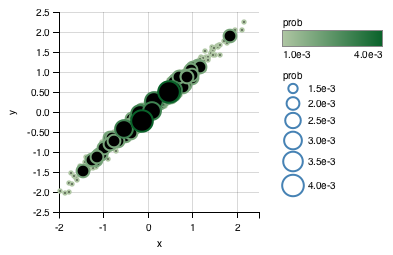     | 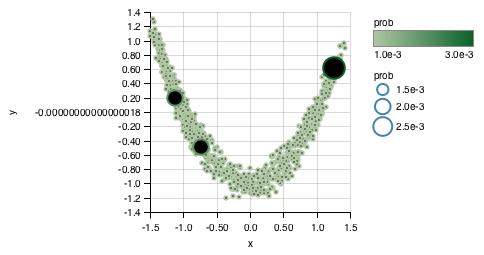
VI     | 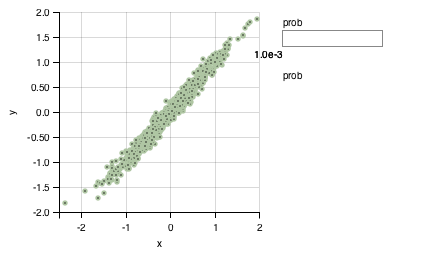       | 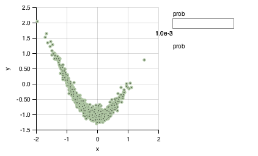

(The posterior produced by VI is usually more symmetric than the plot
above, but this is what I happened to get when preparing this
section.)

## Long Range Dependencies

With this guide it is possible to capture (with some degree of
fidelity) a single pair-wise dependency over a long range.

Here's an example of the marginal posterior for a model of length 32
with the linear dependency from the previous section. Progress
optimizing the ELBO over 3 similar runs is also shown.

posterior marginal | ELBO progress
------------------ | ---
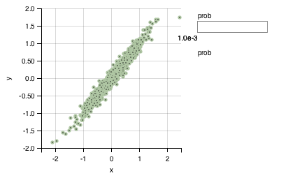|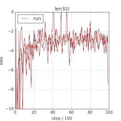

In contrast to the recurrent guide this seems quick, reliable and
doesn't require a large hidden state. The recurrent guides nearly
always failed to capture this dependency when the length of the model
is 32. (Even when optimizing the EUBO, using more hidden units, more
optimization steps, and more samples per-step. Note that
[similar plots](https://gist.github.com/null-a/faa1f70735efe15f23354ec7390a7912#gistcomment-1915797)
for recurrent guides show runs that used 20 times the number
executions used here.)

A non-linear dependence can also be captured, although less reliably
than the linear case. When the length of the model is 8 it usually
works, when it is 32 it usually fails.

## Accurately representing intermediate choices

When the only dependency in the posterior is between the first and
last choices, all intermediate choices remain independent and take the
same mean/variance as in the prior.

This would be easily represented by a mean field guide of course,
since there are per choice parameters for the mean and variance that
can be set appropriately.

To understand something about how the guides used here handle this, we
plot the value sampled at the first random choice (`x`) vs. the mean
parameter output by the predict net for an intermediary choice.

We see that this isn't particularly close to the optimal solution,
which would be to output zero regardless of the value sampled. This
shape probably arises because the (shared) predict net is computing
something very similar at the final choice in order to capture the
quadratic dependency.

intermediate | final
-------------|---
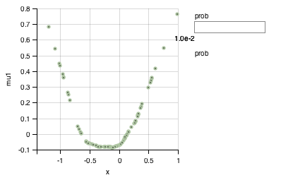 | 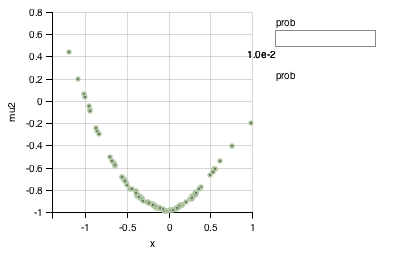

To test this, we flip the sign on the dependency.

intermediate | final
-------------|---
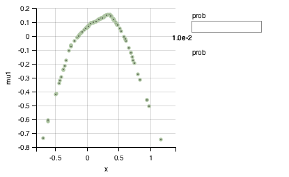 | 

## Multiple Dependencies

To test the guide's ability to capture more than a single pair wise
correlation we perform inference on a variation of the model that
includes both the linear and quadratic dependencies. That is:

```js
var model = function() {
    var x = gaussian(0, 1);
    var y = gaussian(0, 1);
    var z = gaussian(0, 1);
    factor(-40 * Math.pow(1 + y - Math.pow(x, 2), 2));
    factor(-40 * Math.pow(x - z, 2));
    return {x, y, z};
};
```

Posterior marginals:

linear | quadratic
-------|---
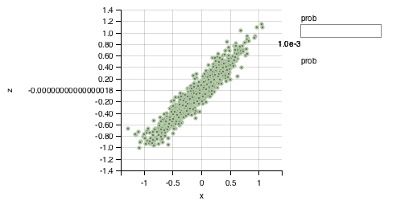|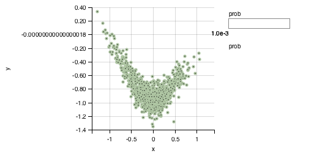

Here the quadratic dependency appears more V shaped than earlier. My
guess is that the predict net needs a larger hidden state and/or
additional optimization steps to capture both of these accurately.

Here's the same model where the predict net hidden state has length
200 (vs. 60) after taking 20K (vs. 10K) gradient steps.

linear | quadratic
-------|---
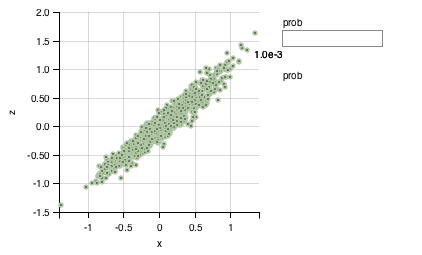|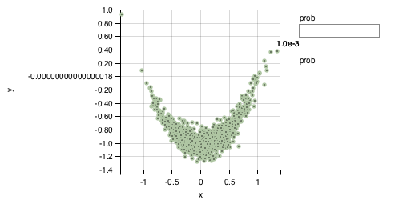

## Speculation on why this works better than a recurrent guide (for this problem)

- There's a simple (i.e. shallow) MLP between any pair of choices?
- The per choice scalar parameter used for updating the hidden state
  appears *crucial*. My original motivation in adding this was to
  provide a way to avoid incorporating all sampled choices into the
  hidden state, that was within easy reach of optimization. However,
  optimization usually finds solutions that surprise me, and I doubt
  that this is used in the way I anticipated. Initializing these
  parameters to zero (or close to zero) is also important.
- Using the ReLU non-linearity in the predict net seems important.
  (IIRC, this didn't help when I tried it with a regular RNN as part
  of the recurrent guide experiments.)

## Todo

- Sharing the predict net between choices is appealing because more
  than one choice may need to compute the same function of an earlier
  choice, and because we might hope we can use a large predict net and
  leave optimization to decide where best to use that capacity. On the
  other hand, it might be that the use of a single net makes capturing
  multiple dependencies and outputting constant parameters for
  independent choices more difficult than it would otherwise be. One
  obvious thing to try is per choice predict nets. What alternatives
  are there between these two extremes?
- Understand what role the per choice scalar parameter plays in the
  hidden state update.
- Is there a way to put mean field type solutions within easier reach
  of optimization. (I briefly tried something based on adding mean
  field parameters with a gate to choose between these and the output
  of the predict net, but this didn't seem to help much.)
- Can this guide handle the intermediary choices taking on differing
  means/variances in the posterior?
- Figure out why capturing long range non-linear dependencies doesn't
  work as well as capturing long range linear dependencies. Since we
  have a simple MLP between even distant choices, one might hope we
  could do better. Perhaps intermediary choices are unnecessarily
  added to the hidden state, creating noise? Or perhaps this has
  something to do with the predict net trying to model the constant
  function for many intermediary choices.
- What's the delta between this and Noah's earlier ResNet-like
  suggestions? Roughly, the hidden state update would also incorporate
  (additively) a non-linear combination of the sampled value and the
  previous state?
- Revisit recurrent guides and see if anything learned here can be
  used to improve things there. (Since the guide described here
  doesn't seem very well suited to e.g. time series?)
- Try similar guides in the amortized/data dependent guide setting.
